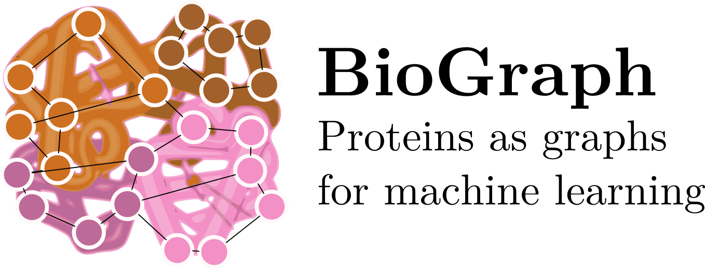

BioGraph is a library for manipulating structures in PDB files as graphs
with the purpose of training machine learning models. Additionally
it provides functionality for making pipelines based on those graphs.
It is based on [BioPython](https://github.com/biopython/biopython).

In short, this package provides the following functionality:

* representing a PDB file as a `networkx.Graph` through a structure
generator. Different generators can be used to create different
graphs. For example, one can generate a static contacts graph,
or a graph that captures the topology of the protein (e.g.
through Delauney filtration).

* adding features to either the protein (represented as a pandas
dataframe) or the graph through sequence alignment.

* diffusing or propagating features along neighbors and optionally
converting the end result to a dataframe, for use in machine learning
models that a priori _do not_ take the graph structure as input.

* making cross validation fold according to CDHit groups to avoid
bias in training.


### Installation

Since BioGraph has quite a few dependencies that need to be compiled
prior to installing, we've yet to figure out if it's possible only
using `pip`.

Fortunately `setuptools` provides more than enough functionality
to automate these tasks, so just running:

```
# python setup.py install
```

should do the trick. This is a full installation, including the
Visual Molecular Dynamics python package. Since that is a heavy
package that is only used for static contact graph generation,
you may wish to avoid installing it. That can be done by
building first with the `ignore-vmd` flag:

```
# python setup.py build --ignore-vmd=yes
# python setup.py install --skip-build
```

### Examples

Example notebooks are provided in `examples/`. The most
straightforward machine learning example is in
`examples/ExamplePipeline.ipynb`.


### PyMol

Installing the package also installes a script called `biograph_pymol_path`.
Running it provides output similar to the following:

```
$ biograph_pymol_path 
Run BioGraph on PyMol using the following command in the PyMol console:
run /usr/local/lib/python3.6/dist-packages/biograph/pymol.py
```

In a PyMol session, running that command will give you a new command named 
`delaunay`. After fetching a protein, you can run `delaunay PDB_id` to view 
the surface of the complex which would be used to generate the structure graph.

As an example, take the following PyMol session history:

```
run /usr/local/lib/python3.6/dist-packages/biograph/pymol.py
fetch 4STD
delaunay 4STD
```

again, take into account that the path may be different.

